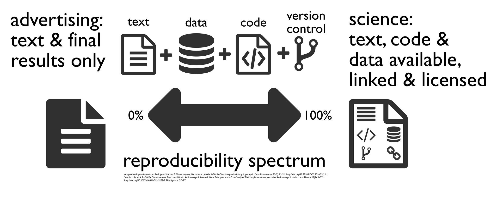
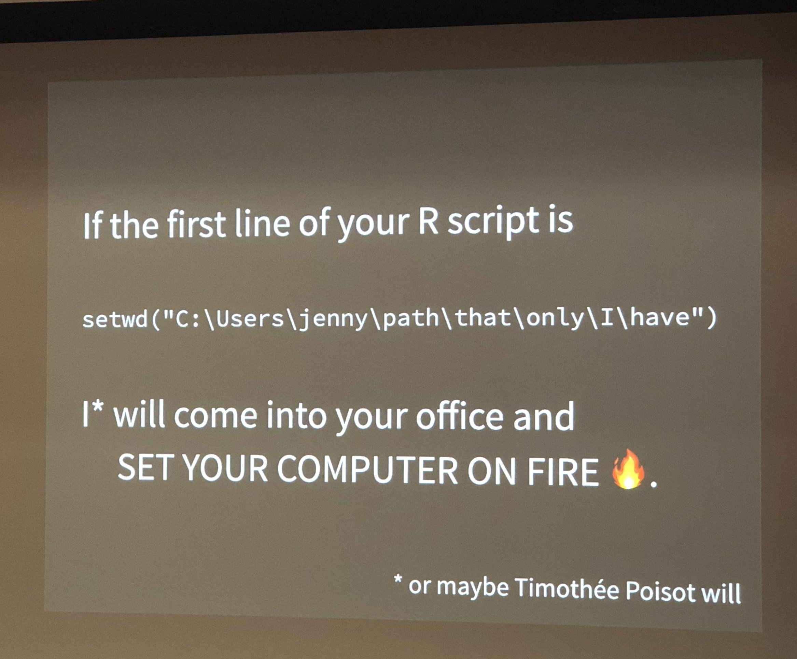
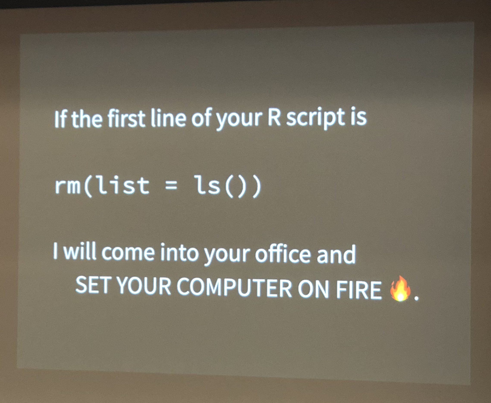

```{r setup, include = FALSE}
box::use(
	rmarkdown,
	markdown,
	here
)
```

# About me

* PhD student in Epid/Bios working with Andreas Handel
* Started using R (Markdown) in 2017.
* I do pretty much all of my research in R / R Markdown / Quarto.
* For more info see [https://wzbillings.com](https://wzbillings.com).

# Learning goals

By the end of this workshop you should be able to:

1. Articulate the necessity of and basic concepts behind reproducible research;
1. Start a new R project, and know the advantages of using one;
1. Explain how the R history inhibits reproducible research';
1. List which parts of the coding environment are real and which are temporary;
1. Use good coding practices for handling dependencies in an R project;
1. Organize your code into R Markdown and R script files, and justify your
choice of organization;
1. Rewrite R code in a modular format; and
1. Make a plan for implementing these and other reproducible research tools in
your own work.

That's a lot of learning goals for this amount of time, so we better get
started.

# What is RR



Reproducible research is the idea that another researcher should be able to
take your code and your data and reproduce your analytic results! (Different
from, but related to, the also-important concept of replicability.)

**What do you need to reproduce an analysis?**

A lot of the time, people want you to start with 7000 things all at the same
time and make your research automatically reproducible and use a bunch of
different softwares. Reproducible research can often feel like an unattainable
cliff that will make you think "ok, well I can't do all that, so why even try?"

](static/eeaao.jpg)

</br>

IMO this reproducible research stuff is often incredibly overwhelming. People
seem to want you to transfer from SPSS to makefiles and automated code
instantly. But I don't want you to do that.

Instead of talking about "best" reproducible research practices, let's talk
about "good enough" reproducible research practices. You know, stuff that
will be good enough to get you through any federal funding mandates for
reproducibility that come out.

If you want to know more about the motivations for reproducible research and
open science in general, you can see [my powerpoint for that on my
website](https://wzbillings.com/presentations/open-science-ceid/). I also have
a bit of a longer walkthrough of some RR concepts you can see
[here](https://wzbillings.com/presentations/reu-workshop2023/), but that
really needs to be cleaned up. I also have a page that I wrote for my adviser
Andreas' online course, which you can find [here](https://andreashandel.github.io/MADAcourse/Open_Science.html).
He edited that one, so it's maybe better.

For an example of a reproducible research project, you can check out my
collaborator [Dr. Brian McKay](https://www.fcs.uga.edu/people/bio/brian-mckay)'s 
paper that you can find [on data 
dryad](https://datadryad.org/stash/dataset/doi:10.5061/dryad.51c59zw4v). You
can actually download all the data and code from here, and the last time I
checked it, I could still get all the code to run on my computer.

Let's go ahead and get started with those "good enough statistical practices."


# R projects and aRson

How does R find your files?

To talk about that, we probably need to talk about what a file tree is.


[Image source](https://informationtechnologyja.wordpress.com/2020/10/19/information-technology-grade-9-lesson-2-tree-directory-structure/)

*R has a neat thing called the* ***working directory*** *that makes the
whole tree easier to navigate.*

For example, if I need you to go get something from my house, and you got
no clue where that is, I have to tell you:
1. Get to Athens, GA.
1. Go to [Zane's House Address].
1. Go inside and go upstairs.
1. Go into the first room.
1. Go to the bookshelf.
1. Look at the third shelf.
1. Grab the book I asked you for.

Of course, if you already know where my house is, I can skip the first few
bullet points -- this is the same thing that the working directory is doing.
The working directory is an address in the file tree that says "OK R, when I
tell you to look for a file, start here."

```{r}
getwd()
# setwd()
```

**Can you imagine any problems with this?**

</br>

</br>

What if our mutual friend has the same book, and you want to get it from their
house? You can't follow the address to my house and get the book!!



Solutions:
* The old way was to use relative file paths, but this is really fragile.
* New way: use an **R Project** and the `here` package.
* I recommend that everything read
[this blog post](https://www.tidyverse.org/blog/2017/12/workflow-vs-script/).

```{r}
here::here()
```

# Things that are real and not real

Unfortunately, R has a tendency of asking whether you want to save your
history when you close the program. You should always say NO! ***Why?***



This is discussed more in that blog post I already linked by Jenny Bryan.
In short, **you want each run of your script to be independent**!

**YOU SHOULD DO THIS ON EVERY COMPUTER YOU SET UP WITH R!!**

```{r}
# install.packages("usethis")
usethis::use_blank_slate()
```

In the same line of thinking, it is tempting to think that all those things in
your R environment are REAL. But they are NOT REAL. They are TEMPORARY things
created by your code. And things in your R history are worse than not real,
they are GHOSTS (which are not real and also scary).

# Packages`::`functions, `box`, and `renv` 

Often when people program in R, they type stuff like

```r
library(MASS)
boxcox(mpg ~ wt, data = mtcars)
```

This is the easiest and most confusing way to deal with packages in R.
If you follow the (appropriate) recommendation that all your `library()`
invocations should go at the start of the script (*why* is this a good
recommendation?), your code might have a lot of distance between the
`library()` invocation, and the invocation of the function from that package.

So it's always better (for your future self and for others) to explicitly
write it like this.
```r
MASS::boxcox(...)
```

This solves multiple problems! For example, if you like tidyverse, but you do
```r
library(dplyr)
library(MASS)

dat <- select(mtcars, mpg, wt)
```

You will be surprised to see that your code doesn't work! But it would if you
instead said `dplyr::select(...)`. So I recommend that you always, ALWAYS
use the `::` when you call a function from a package.

## `box`

A lot of other languages force you to do this by default. For example, in Python
if you wrote
```python
import statsmodels.api as sm
Logit(y, x).fit()
```

you would get an error. You have to write
```python
import statsmodels.api as sm
sm.Logit(y, x).fit()
```
instead. If you want to get away without the `sm.`, you have to do either
```python
from statsmodels.api import Logit
Logit(y, x).fit()
```
or
```python
from statsmodels.api import *
Logit(y, x).fit()
```

which imports all functions from `statsmodels.api` into your environment. Note
that this is what R's `library()` function does by default, and this is
generally not recommended in Python. R has some built in functionality like
this, for example you can do

```r
library(dplyr, import.only = `%>%`)
```

Which lets you use the pipe operator in a normal way. A better way to list our
dependencies in `R` and avoid filling up the global environment with stuff
we won't use is the `box` package.

```r
box::use(dplyr)
```

We can look at their [README](https://github.com/klmr/box) for more info.

## `renv`

We still have the issue of installing packages in the first place though. If
you send me your nicely formatted `R` project, I still don't have the packages
you used, even if you put `box::use(my_cool_pkg)` at the top of your script.

Suppose that you have `my_cool_pkg v1.4` installed on your computer. It works
great, and you haven't even thought about updating it cause you never had any
issues with it. However, you send me your code, and I run
`install.packages("my_cool_pkg")` and it gives me `v2.3`. Somewhere along the
line, they change the function `my_cool_pkg::fancy_regression()` so that
it does regularized regression in `v2.3`, but in `v1.4` it still does plain
unregularized regression. Then I'll get different results from you! And it
will probably be hard to find out why.

That's where `renv` comes in. `renv` is fantastic, but it can be a bit tricky
--fortunately every version so far has gotten a bit easier to use. I recommend
everyone read the [main page](https://rstudio.github.io/renv/articles/renv.html)
of their documentation, but we can walk through an example as well.

# Programming style and documentation

Even if you don't follow anything else I say, this is the most important part!
You can do all these reproducible research tricks, but they are still not
very helpful if no one can understand what your code does.

## Literate programming

* **code** is interspersed with **text** (like in this document)
* code comments explain HOW the code works, and text explains WHY you're
writing particular code.
* Think about it this way: if you took your most recent manuscript, and added
in code chunks at each step of the methods and results, that would be
literate programming.

The main downside here is that code can often get very complicated. Here's an
example. First I'll show the easy to read, good version.

```r
lm(mpg ~ wt, data = mtcars)
```

Now imagine if instead of that I did this.
```r
my_function <- function(formula, data, subset, weights, na.action, method = "qr", 
	model = TRUE, x = FALSE, y = FALSE, qr = TRUE, singular.ok = TRUE, 
	contrasts = NULL, offset, ...) 
{
	ret.x <- x
	ret.y <- y
	cl <- match.call()
	mf <- match.call(expand.dots = FALSE)
	m <- match(c("formula", "data", "subset", "weights", "na.action", 
		"offset"), names(mf), 0L)
	mf <- mf[c(1L, m)]
	mf$drop.unused.levels <- TRUE
	mf[[1L]] <- quote(stats::model.frame)
	mf <- eval(mf, parent.frame())
	if (method == "model.frame") 
		return(mf)
	else if (method != "qr") 
		warning(gettextf("method = '%s' is not supported. Using 'qr'", 
			method), domain = NA)
	mt <- attr(mf, "terms")
	y <- model.response(mf, "numeric")
	w <- as.vector(model.weights(mf))
	if (!is.null(w) && !is.numeric(w)) 
		stop("'weights' must be a numeric vector")
	offset <- model.offset(mf)
	mlm <- is.matrix(y)
	ny <- if (mlm) 
		nrow(y)
	else length(y)
	if (!is.null(offset)) {
		if (!mlm) 
			offset <- as.vector(offset)
		if (NROW(offset) != ny) 
			stop(gettextf("number of offsets is %d, should equal %d (number of observations)", 
				NROW(offset), ny), domain = NA)
	}
	if (is.empty.model(mt)) {
		x <- NULL
		z <- list(coefficients = if (mlm) matrix(NA_real_, 0, 
			ncol(y)) else numeric(), residuals = y, fitted.values = 0 * 
			y, weights = w, rank = 0L, df.residual = if (!is.null(w)) sum(w != 
			0) else ny)
		if (!is.null(offset)) {
			z$fitted.values <- offset
			z$residuals <- y - offset
		}
	}
	else {
		x <- model.matrix(mt, mf, contrasts)
		z <- if (is.null(w)) 
			lm.fit(x, y, offset = offset, singular.ok = singular.ok, 
				...)
		else lm.wfit(x, y, w, offset = offset, singular.ok = singular.ok, 
			...)
	}
	class(z) <- c(if (mlm) "mlm", "lm")
	z$na.action <- attr(mf, "na.action")
	z$offset <- offset
	z$contrasts <- attr(x, "contrasts")
	z$xlevels <- .getXlevels(mt, mf)
	z$call <- cl
	z$terms <- mt
	if (model) 
		z$model <- mf
	if (ret.x) 
		z$x <- x
	if (ret.y) 
		z$y <- y
	if (!qr) 
		z$qr <- NULL
	z
}

my_function(mpg ~ wt, data = mtcars)
```

These will give you the exact same output, but it's pretty clear why you
would want to use one instead of the other, right? This is demonstrating the
importance of **scripts** and **functions**!

There are other options for literate programming, but right now the standout
platform is **Quarto**. Quarto is newer and thus somewhat more buggy and less
feature-full than R Markdown. And you have to install another program. But I
highly recommend Quarto. R markdown, Jupyter, and iJulia/Pluto.jl are all
pretty good and also free.

## Specific information for R markdown

* [YAML header](https://zsmith27.github.io/rmarkdown_crash-course/lesson-4-yaml-headers.html)
* [Code chunks](https://rmarkdown.rstudio.com/lesson-3.html)
* [Markdown formatting](https://github.com/adam-p/markdown-here/wiki/Markdown-Cheatsheet) -- R Markdown uses "GitHub Flavored Markdown" but has some support for
["Pandoc-flavored" markdown too.](https://garrettgman.github.io/rmarkdown/authoring_pandoc_markdown.html)

## R functions and scripts

* A **function** is a modular piece of code that you can reuse without typing
the entire code chunk out a second time.
* A **script** is a file that contains R code and nothing else.

A good design pattern is to organize your code into functions, your functions
into scripts, and then `source()` those scripts into your literate programming
documents.

Of course I think it's easier to learn by example instead of by me talking
about it in these notes.

# Bibliographies and Zotero

* Bibliographies are implemented seamlessly into R Markdown and Quarto via
**bibTeX**. Fortunately, if you don't know bibTeX you don't have to learn it.
* [Zotero](https://www.zotero.org/) is a free program which allows for easy
managing and syncing of bibliographies.
* The `csl` file controls the appearance of your bibliography. You can find one
for pretty much any journal [here](https://www.zotero.org/styles).
* I highly recommend the [better BibTeX](https://retorque.re/zotero-better-bibtex/) plugin as well.
* The R Markdown cookbook has a [fairly comprehensive section](https://bookdown.org/yihui/rmarkdown-cookbook/bibliography.html) on bibliographies. There is a similar page for Quarto.

# Git


* Git is complicated, there is no denying. But it is also the easiest
version control system.
* Even installing Git is complicated. I recommend following along with
Jenny Bryan's book [Happy Git with R](https://happygitwithr.com/).
* We'll talk about the very basics.

# Recommended readings

* Reproducible research in general:
	* [Best practices for statistical computing](https://journals.plos.org/plosbiology/article?id=10.1371/journal.pbio.1001745)
	* [Good enough practices for statistical computing](https://journals.plos.org/ploscompbiol/article?id=10.1371/journal.pcbi.1005510) (the main inspiration for
this workshop
	* MADA pages on [reproducibility](https://andreashandel.github.io/MADAcourse/Tools_Reproducibility.html) and [open science](https://andreashandel.github.io/MADAcourse/Open_Science.html).
* R Programming
	* Hadley Wickham's book [R for Data Science](https://r4ds.hadley.nz/) is quite good, but focuses mainly on "how do I program in R" and not "how do I make
	my code better". But in general it will help with both.
	* The [tidyverse style guide](https://style.tidyverse.org/)
	* [Section 2 of R4Epi](https://www.r4epi.com/r-scripts)
	* Intermediate or advanced R users may appreciate [The R Inferno](https://www.burns-stat.com/pages/Tutor/R_inferno.pdf) or Hadley Wickham's [Advanced R](https://adv-r.hadley.nz/) or Norman Matloff's book "The
	Art of R Programming", which is not free but is findable online.
* R Markdown
	* [The R Markdown cookbook](https://bookdown.org/yihui/rmarkdown-cookbook/)
	* [Bookdown book](https://bookdown.org/yihui/bookdown/) (Bookdown is an
	extension to R Markdown that provides many useful features for manuscript
	writing. This book has a lot of useful advice but if you are serious about
	writing manuscripts with literate programming, I do recommend considering
	Quarto as well.)
* Quarto:
	* [Getting started](https://quarto.org/docs/get-started/)
	* [Tutorial](https://quarto.org/docs/get-started/hello/rstudio.html)
* Git and GitHub:
	* [https://rafalab.dfci.harvard.edu/dsbook/git.html](https://rafalab.dfci.harvard.edu/dsbook/git.html)
	* [https://peerj.com/preprints/3159/](https://peerj.com/preprints/3159/)
	* [the Oh my Git! game](https://ohmygit.org/)
	* [MADA course page on Git](https://andreashandel.github.io/MADAcourse/Tools_Github_Introduction.html)

<!-- END OF FILE -->
